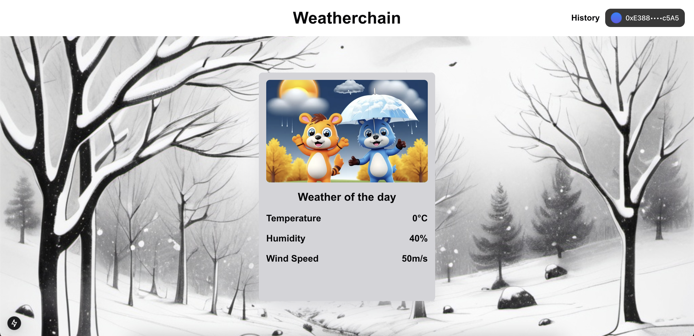

# Weatherchain


Weatherchain is a project combining blockchain technology and weather data. This project enables the creation (minting) of NFTs and the periodic updating of their metadata with simulated weather information.

## Author

- [@Coralie Boyer](https://github.com/coralieBo)

## Demo





## Smart contract address
[0xE9e1AF4A0353357920ECEf276B94687C0009764D](https://testnet.snowtrace.io/address/0xE9e1AF4A0353357920ECEf276B94687C0009764D)

## Installation

### Clone this repos with

```bash
git clone https://github.com/CoralieBo/Weatherchain.git
```

### Deploy smart contract with
```bash
forge create --rpc-url RPC_URL --private-key PRIVATE_KEY --legacy --broadcast  Weather
# Don't forget to replace RPC_URL and PRIVATE_KEY
```

### Install app dependancies with
```bash
npm install
```

### Run app with
```bash
npm run dev
```
or
```bash
npm run build
npm start
```

## Environment Variables

To run the app, you will need to add the following environment variables to your .env file

`NEXT_PUBLIC_CONTRACT_ADDRESS`
